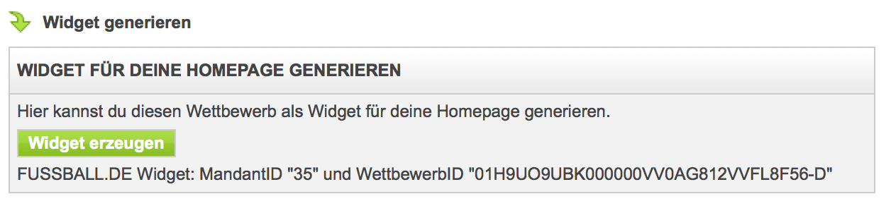

.. ==================================================
.. FOR YOUR INFORMATION
.. --------------------------------------------------
.. -*- coding: utf-8 -*- with BOM.

.. include:: ../Includes.txt

.. _admin:

====================
Administrator Manual
====================

Target group: **Administrators**

Schlüssel, MandantID und WettbewerbID auf Fussball.de abrufen
=============================================================

#. Mannschaft auf Fussball.de suchen
#. Meisterschaftswettbewerb auswaehlen
#. Am Ende der Seite den Link "Widget generieren" anklicken. Hier können die MandantID und WettbewerbID abgelesen werden
#. Weiteren Informationen und die Generierung des Schlüssels können über den Button "Widget erzeugen" abgerufen werden

	Widget generieren befindet sich unter allen Wettbewerben (Begegnungen, Tabellen, usw.) auf fussball.de

Inhaltselement anlegen
======================

#. Symbol fuer "Seiteninhalt anlegen" anklicken
#. Im Reiter "Plug-Ins" im Fenster "Neues Inhaltselement" das "Allgemeines Plug-In" anklicken
#. Im Reiter "Plugin-In" den Eintrag "Fussball.de" bei "Ausgewähltes Plug-In" auswählen
#. Erweiterungsoptionen im Reiter "Plugin-In" konfigurieren.
#. Speichern - fertig