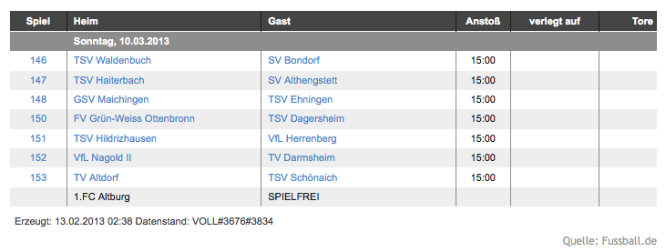

..  Editor configuration
	...................................................
	* utf-8 with BOM as encoding
	* tab indent with 4 characters for code snippet.
	* optional: soft carriage return preferred.

.. Includes roles, substitutions, ...
.. include:: _IncludedDirectives.rst

=================
Extension Name
=================

:Extension name: Fussball.de JavaScript
:Extension key: larsp_fussballde_js
:Version: 2.0.0
:Description: Bindet Tabellen und Spielplaene von Fussball.de ueber JavaScript ein. Anmeldung auf Fussball.de ist noetig!
:Language: de
:Author: Lars Peipmann
:Creation: 2013-02-13
:Generation: 22:21
:Licence: Open Content License available from `www.opencontent.org/opl.shtml <http://www.opencontent.org/opl.shtml>`_

The content of this document is related to TYPO3, a GNU/GPL CMS/Framework available from `www.typo3.org
<http://www.typo3.org/>`_

**Table of Contents**

.. toctree::
	:maxdepth: 2

	AdministratorManual
	TyposcriptReference

What does it do?
=================

Fussball.de bietet einen Service an, mit dem es möglich ist, aktuelle Ergebnisse und Tabellen von lokalen, sowie Bundesligavereinen auf der eigenen Homepage anzeigen zu lassen.

Diese Extension hilft diesen Service auf TYPO3-Seiten einzubinden.

Screenshots
=================

Die folgenden Bilder veranschaulichen die Ausgabe des Plugins im Frontend:

.. figure:: Images/plugin.png
:width: 552px
		:alt: Plugin Konfiguration

			Alle Einstellungen können über das Plugin oder TypoScript angepasst werden.

:width: 731px
		:alt: Spieltag

			Anzeige eines Spieltags mit CSS

.. figure:: Images/spieltagOhneCss.png
:width: 520px
		:alt: Spieltag ohne CSS

			Anzeige eines Spieltags ohne CSS

.. figure:: Images/tabelle.png
:width: 738px
		:alt: Tabelle

			Anzeige einer Tabelle mit CSS

.. figure:: Images/tabelleOhneCss.png
:width: 515px
		:alt: Tabelle ohne CSS

			Anzeige einer Tabelle ohne CSS

Fehler & Anregungen melden
-----------------------------------

Fehler und Anregungen koennen jederzeit sehr gerne im `Bug Tracker`_ gemeldet werden.

.. _Bug Tracker: https://bitbucket.org/lars85/typo3-extensions-larsp_fussballde_js/issues?status=new&status=open