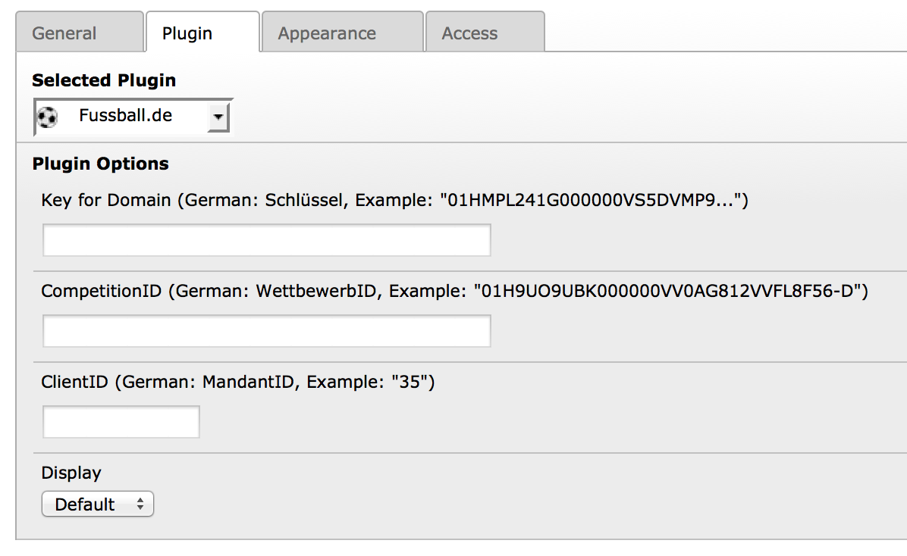
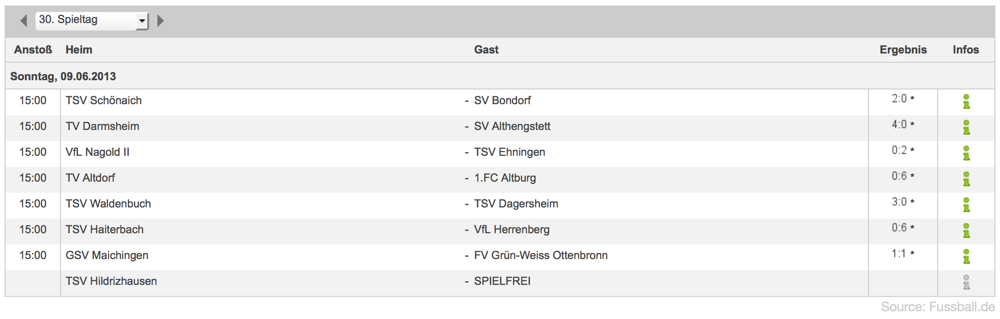
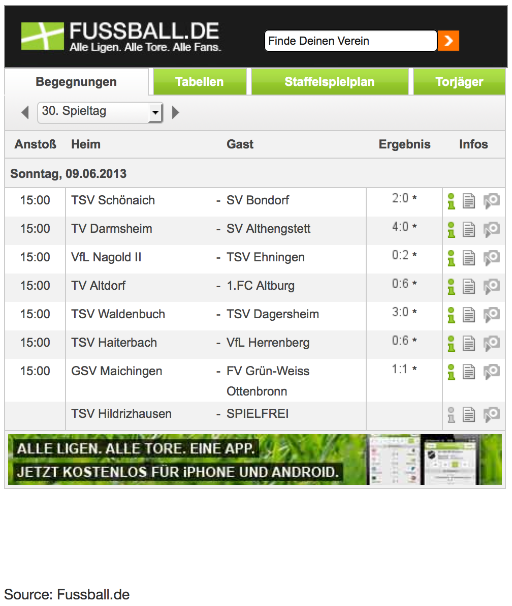
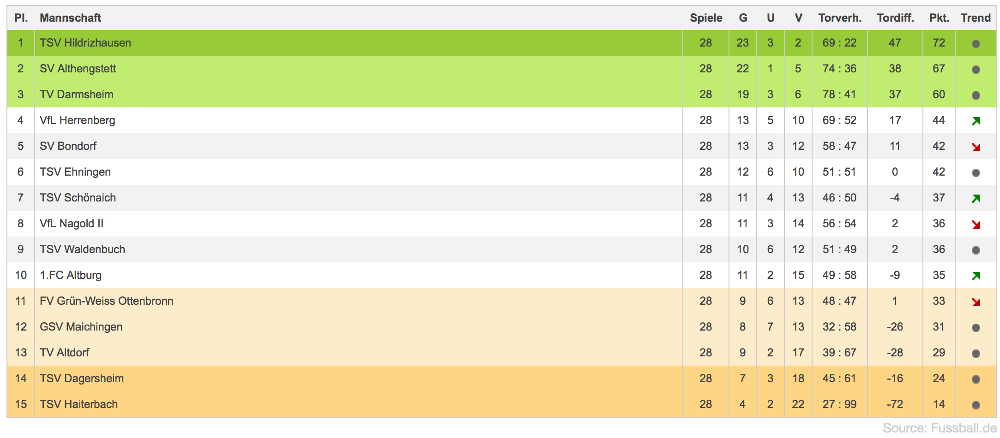
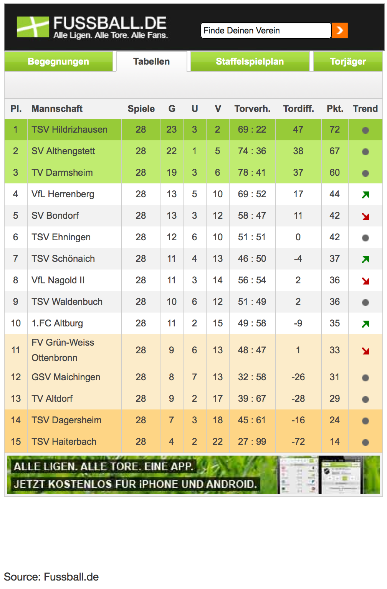

.. ==================================================
.. FOR YOUR INFORMATION
.. --------------------------------------------------
.. -*- coding: utf-8 -*- with BOM.

.. include:: ../Includes.txt

.. _screenshots:

===========
Screenshots
===========

Die folgenden Bilder veranschaulichen die Ausgabe des Plugins im Frontend:

	Alle Einstellungen können über das Plugin oder TypoScript angepasst werden.

	Anzeige der Begegnungen mit CSS.

	Anzeige der Begegnungen ohne CSS.

	Anzeige einer Tabelle mit CSS.

	Anzeige einer Tabelle ohne CSS.