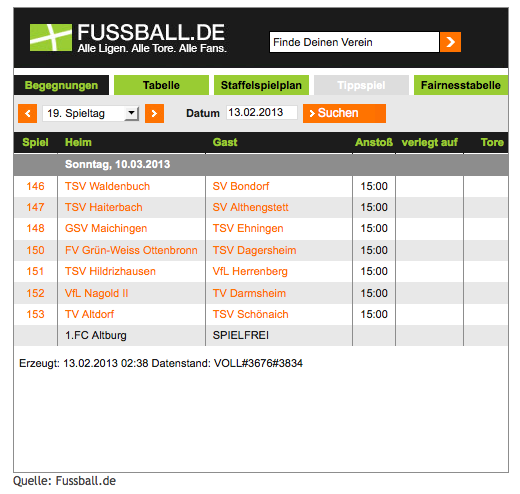

.. ==================================================
.. FOR YOUR INFORMATION
.. --------------------------------------------------
.. -*- coding: utf-8 -*- with BOM.

.. include:: ../Includes.txt

.. _screenshots:

===========
Screenshots
===========

Die folgenden Bilder veranschaulichen die Ausgabe des Plugins im Frontend:

.. figure:: Images/plugin.png
	:width: 552px
	:alt: Plugin Konfiguration

	Alle Einstellungen können über das Plugin oder TypoScript angepasst werden.

.. figure:: Images/spieltag.png
	:width: 731px
	:alt: Spieltag

	Anzeige eines Spieltags mit CSS.

	Anzeige eines Spieltags ohne CSS.

.. figure:: Images/tabelle.png
	:width: 738px
	:alt: Tabelle

	Anzeige einer Tabelle mit CSS.

.. figure:: Images/tabelleOhneCss.png
	:width: 515px
	:alt: Tabelle ohne CSS

	Anzeige einer Tabelle ohne CSS.