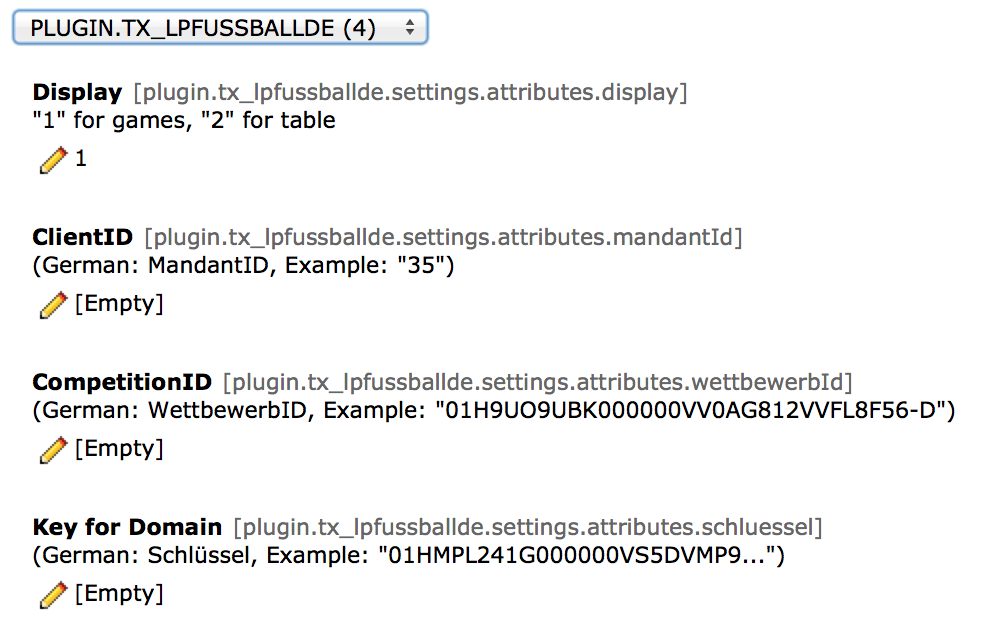

.. ==================================================
.. FOR YOUR INFORMATION
.. --------------------------------------------------
.. -*- coding: utf-8 -*- with BOM.

.. include:: ../Includes.txt

.. _typoscript:

==========
TypoScript
==========

CONSTANTS
=========

Können über den Constanten-Editor bearbeitet werden.

	Alle Konstanten können über den Constants-Editor angepasst werden.

Mehrere Domains in den CONSTANTS verwalten
==========================================

Je Domain muss bei Fussball.de eine Domain registriert werden.

Falls die Seite ueber verschieden Domains erreichbar ist, kann der Schlüssel über die folgende Einstellung bei weiteren Domains ausgetauscht werden:

::

	[globalString = ENV:HTTP_HOST=domain.de]
	plugin.tx_lpfussballdef4x.settings.attributes.schluessel = ABC...
	[global]

..

Mehrere Domains im SETUP verwalten
==================================

Als weitere Möglichkeit können auch weitere Domain im SETUP über die folgenden Einstellungen hinzugefügt werden:

::

	plugin.tx_lpfussballdef4x.includeJs.10.lpFussballdeF4x_schluessel.cObject {
		domain_de = TEXT
		domain_de.value = ABC..

		subdomain_domain_de = TEXT
		subdomain_domain_de.value = XYZ...
	}

..

Standard-CSS im SETUP deaktivieren
==================================

::

	plugin.tx_lpfussballdef4x._CSS_DEFAULT_STYLE >

..